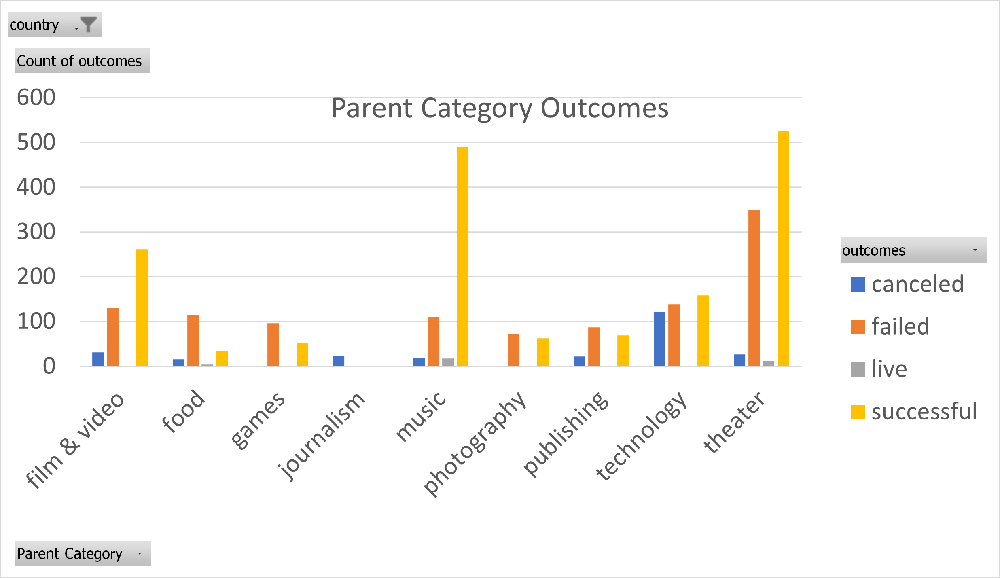
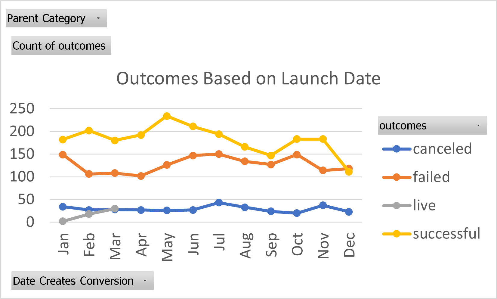
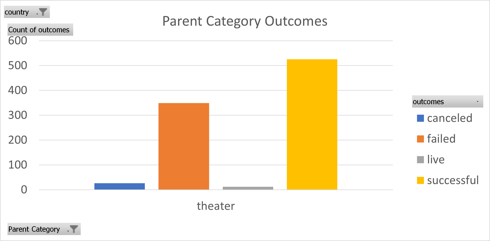
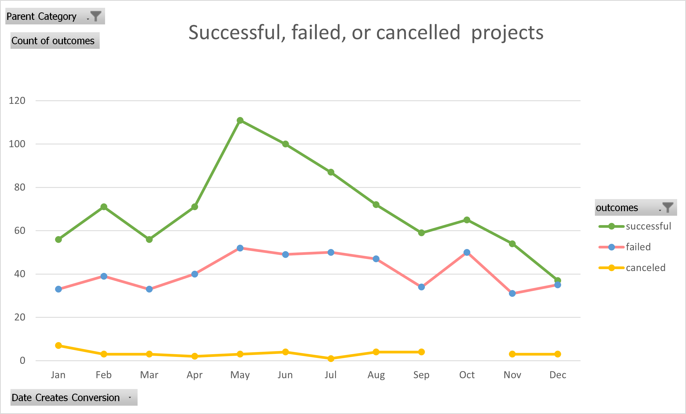
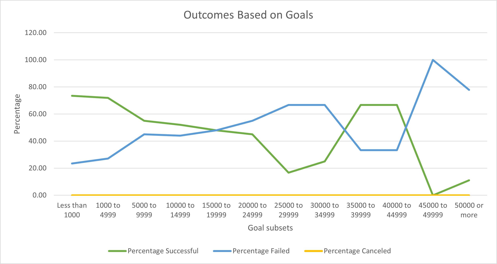

# Kickstarting with Excel

## Overview of Project
This project consists in the evaluation of Kickstarter campaigns data, to understand the behaviour of this kind of events. Using different variables like time, country, funding goals, raised funds, type of project, among other variables, as well as the creation of new adjusted or filtered information extracted from the dataset we try to strengthen our understanding of this events. 

### Purpose
Using the dataset of Kickstarterhe the following analysis has as objective, to try advice Louise, our client, regarding the behaviour when setting up a kickstarter campaign in general and more specific for theatre plays, as her goal is run a Kickstarter campaign to obtain funds for her theatre play Fever. Providing a guide using dataset analysis richer and stronger to help her run a successful campaign. 

## Analysis and Challenges
The following link reference to the excel worksheet: [kickstarterchallenge](kickstarter_challenge_copy.xlsx)

The analysis was performed using excel as our data analysis tool. Excel allowed to sort, filter, and visualise different characteristics and behaviour of each variable. 
First using categorizations, we evaluated the number of campaigns related to different categories and if they were successful, live, cancelled or failed in their campaigns. 

In this we can see that most successful categories campaigns outcomes are seen in music and theatre, whereas lesser outcomes are in food and games categories.  In this project the category of interest was theatre where we can see a big number of outcomes both in successful and failed campaigns, whereas there were fewer cancelled and live outcomes. 

  
Seeing how the main interest of our client resides in theatres we then analysed the outcomes based on Launch dates. We managed to find that regarding successful kickstarter theatre campaigns, the trimester with higher successful outcomes where April, May and June with the highest peek at May. 

Here we come to one of the limitations of the dataset, because no further details on the campaigns where listed, for instance platform used to spread the campaign or more specific data. Therefore, we can only speculate that apparently summer is a good season to hold this kind of campaign, but we can not sure what other factors may play a role this statement and behaviour of the data. Lowest successful outcome rates were found in September and December, with December at the lowest range. Further detailed data would be needed to explain and backup the explanations of this behaviour, however we could speculate that seasonal festivities and expenses might be involved.  

Following the failed campaigns one can see that the shape of both success and failure seem to trace a similar shape, no stricter statistical analysis was performed to verify such similarity in a quantitative form, yet, this opens up different possibilities that need further analysis. 

To follow up a more detailed examination of theatre campaigns a bar graph was created filtering the information but those in the United States. There it was visible that there was a very small number of cancelled campaigns even smaller number of live ones, and most of the outcomes were either failed or successful ones being the lather the biggest one. 

Finally, we performed a descriptive statistic, obtaining measures of central tendency using pledged money of the campaign, and observing the relationship between successful and failed campaigns in regards of the amounts.  Mean in successful campaigns pledges was $ 5,000, whereas failed campaigns were around the $10,000.  

*Challenges:* 
One of the main challenges about this was to familiarize myself with the new programs to present the results. 
Another issue was to pinpoint the main acervations we can backup with the analysis. Understanding how strong one can be while reading the data to help Louise make decisions.
A third challenge was to understand the true weight of the data one has how far can the analysis conclude objective results and not throw opinions beyond its power, as that may affect the client decision and outcomes. 

The dataset showed enough to give a general idea of the behaviour regarding successful pledges or unsuccessful ones as well as seasons where launched, but there is not a more detailed data to explain the behaviour behind this or other important factors related to it like what other qualities do successful vs. unsuccessful campaigns hold. For instance, that second peak reached in a high amount budget described in the graph of outcomes based on goals. Perhaps other important factors play a role that with the current dataset we cannot explain and consider.  

### Analysis of Outcomes Based on Launch Date

 

By obtaining and understanding the behaviour with those analysis we where able to do two final and important analysis to help Louise in her final spar during the campaign: Theatre Outcomes by Launch Date and Outcomes Based on Goals. 
Visualising Theatre outcomes by Launch date, a more careful advice could be backed up, as seen in the graph most successful theatre projects happened to be in May with a high peek that went slowly down till August, whereas the worst months to launch the projects was December and January. Meaning best season to launch a project would be Summer and worst would be Winter. 

### Analysis of Outcomes Based on Goals

As for Outcomes Based on Goals as its seen in the following graph there seem to be two Goal subsets that seem to be an inverse correlation between percentage of failed pledges vs. percentage of successful pledges. Using Successful percentage Goal subsets as a reference for the description, one can see that pledges that are less than 100 but lower than 5000 seem to have a good successful rate between 60% to 80%, the lowest successful rate was in the 25000 to 3000 Goal subsets with percentages below 40% and grazing. There is a second increase in successful subsets that were between 35000 to 45000 that was not as high as the first peak but was above 60% percentage of success, this one drop drastically when the amount was $45000 to $49999 reaching up to 0% percentage success. 

### Challenges and Difficulties Encountered

One of the challenges about this was to familiarize myself with the new programs to present the results. 
Another issue was to pinpoint the main acervations we can backup with the analysis. Understanding how strong one can be while reading the data to help Louise make decisions.
A third challenge was to understand the true weight of the data one has how far can the analysis conclude objective results and not throw opinions beyond its power, as that may affect the client decision and outcomes. 
The dataset showed enough to give a general idea of the behaviour regarding successful pledges or unsuccessful ones as well as seasons where launched, but there is not a more detailed data to explain the behaviour behind this or other important factors related to it like what other qualities do successful vs. unsuccessful campaigns hold. For instance, that second peak reached in a high amount budget described in the graph of outcomes based on goals. Perhaps other important factors play a role that with the current dataset we cannot explain and consider.  

## Results

- What are two conclusions you can draw about the Outcomes based on Launch Date?

As explained in more detail in the description od the analysis we could get to the following conclusions.
First most successful theatre projects happened to be in May till August, and worst months to launch the projects was December and January. 
Meaning best season to launch a project would be Summer and worst would be Winter. 

- What can you conclude about the Outcomes based on Goals?

Second that pledges that are less than 100 but lower than 5000 seem to have a good successful rate meanwhile, the lowest successful rate was in the 25000 to 3000 Goal subsets

- What are some limitations of this dataset?

Third we can conclude that if one needs to understand more information about this outcomes, one would need more detailed information, for instance, how they promoted the campaigns, the use of social media, or other variables that could be behaviours that the client could adopt to increase her successful rate. 

- What are some other possible tables and/or graphs that we could create?

Louise budget goal was around $12,000 meaning her percentage of success was around 50%. And a good month for her to try to launch such a campaign was around May or June according to the data. 
Another graph that could be obtained of this dataset to complement the information would be one to deepen further into the budget the client has as well as longevity associated with campaigns.

